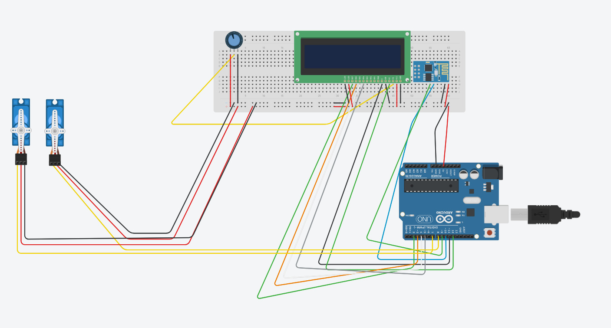

# Arduino-Rirau-ipyra

> Projeto de automação e controle de dispositivos eletrônicos utilizando Arduino e backend Python (FastAPI).

## Tecnologias Utilizadas

- **Arduino UNO**
- **Protoboard**
- **Fios jumper**
- **LEDs**
- **Resistores**
- **Software Arduino IDE**
- **Python 3.12**
- **FastAPI**
- **Uvicorn**
- **Alembic** 
- **SQLite**
- **Docker** e **Docker Compose**

## Requisitos

- Python 3.12+
- Docker e Docker Compose (opcional, mas recomendado)
- Arduino IDE
- Git

## Como Rodar o Projeto

### Usando Docker (Recomendado)

1. **Clone o repositório:**
  ```bash
  git clone https://github.com/seu-usuario/Arduino-Rirau-ipyra.git
  cd Arduino-Rirau-ipyra
  ```
2. **Suba os containers:**
  ```bash
  docker-compose up --build
  ```
3. O backend estará disponível em: [http://localhost:8000](http://localhost:8000)

### Rodando Localmente (sem Docker)

1. **Clone o repositório:**
  ```bash
  git clone https://github.com/seu-usuario/Arduino-Rirau-ipyra.git
  cd Arduino-Rirau-ipyra
  ```
2. **Crie um ambiente virtual e ative:**
  ```bash
  python -m venv venv
  venv\Scripts\activate  # Windows
  # ou
  source venv/bin/activate  # Linux/Mac
  ```
3. **Instale as dependências:**
  ```bash
  pip install -r requirements.txt
  ```
4. **Execute as migrações:**
  ```bash
  alembic upgrade head
  ```
5. **Inicie o backend:**
  ```bash
  uvicorn app.main:app --reload
  ```
6. O backend estará disponível em: [http://localhost:8000](http://localhost:8000)


## Circuito

<!-- Circuito -->



## Estrutura do Projeto

- `app/` - Backend FastAPI
- `alembic/` - Migrações do banco de dados
- `data/` - Banco de dados SQLite
- `tests/` - Testes automatizados
- `Dockerfile` e `docker-compose.yml` - Configuração Docker

  
## Colaboradores

<table>
  <tr>
    <td align="center">
      <a href="https://github.com/Gaby0805">
        <br />
        <sub><b>Gabriel Amorim</b></sub>
      </a>
    </td>
    <!-- Exemplo de outro colaborador -->
    <td align="center">
      <a href="https://github.com/Guilherme-Beckman">
        <br />
        <sub><b>Guilherme Beckman</b></sub>
      </a>
    </td>
  </tr>
</table>

